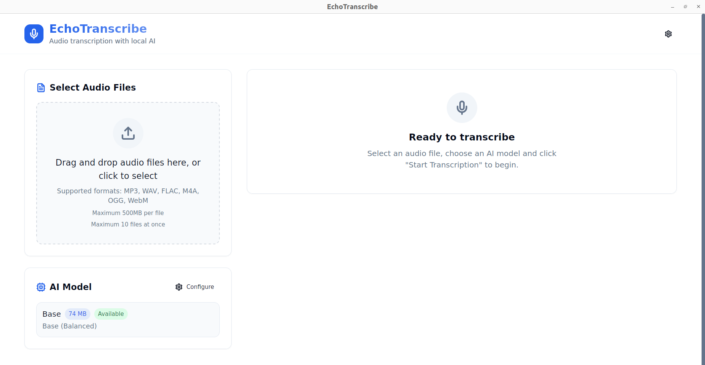

# EchoTranscribe 🎙️

An open-source desktop application for audio transcription using local AI. Private, secure and efficient.



## ✨ Features

- 🔒 **Completely Local**: Your audio files never leave your computer
- 🤖 **Advanced AI**: Uses Whisper models for high-quality transcription
- 🎨 **Modern Interface**: Clean and intuitive design with dark theme support
- 📁 **Multiple Formats**: Support for MP3, WAV, FLAC, M4A, OGG and WebM
- 🔄 **Batch Transcription**: Process multiple files simultaneously
- 🌍 **Automatic Detection**: Automatically identifies audio language
- ⏱️ **Precise Timestamps**: Word-level timestamps for detailed navigation
- 💾 **Flexible Export**: Export to TXT, SRT or JSON
- ⚙️ **Persistent Settings**: Dark/light theme and language saved between sessions
- 🌐 **Multilingual**: Interface in English, Portuguese and Spanish (expandable)
- ⚡ **Performance**: Optimized for speed and efficiency
- 🖥️ **Cross-Platform**: Works on Windows, macOS and Linux

## 🚀 Quick Start

### Prerequisites

- **Node.js** (version 18 or higher)
- **Python** (version 3.8 or higher)
- **Rust** (for Tauri compilation)

#### Linux (Ubuntu/Debian)
```bash
sudo apt update
sudo apt install libwebkit2gtk-4.0-dev libssl-dev libgtk-3-dev libayatana-appindicator3-dev librsvg2-dev libjavascriptcoregtk-4.0-dev
```

#### macOS
```bash
# Using Homebrew
brew install --cask xcode-command-line-tools
```

#### Windows
On Windows, you'll need Microsoft Visual Studio C++ Build Tools.

### Development Installation

1. **Clone the repository**
```bash
git clone https://github.com/your-username/echo-transcribe.git
cd echo-transcribe
```

2. **Install Node.js dependencies**
```bash
npm install
```

3. **Setup Python environment**
```bash
python -m venv .venv
source .venv/bin/activate  # On Windows: .venv\Scripts\activate
pip install -r src-tauri/backend/requirements.txt
```

4. **Run in development mode**
```bash
npm run tauri dev
```

### Production Installation

Download the latest version from [Releases](https://github.com/your-username/echo-transcribe/releases) for your operating system.

## 🎯 How to Use

1. **Select audio file(s)**
   - Drag and drop one or multiple files to the designated area
   - Or click to select files (maximum 10 at once)

2. **Choose AI model**
   - **Tiny/Base**: Fast, ideal for testing
   - **Small**: Better quality, medium speed
   - **Medium**: High quality, slower

3. **Configure options**
   - Leave automatic language detection enabled (recommended)
   - Or manually specify the audio language

4. **Start transcription**
   - Click "Start Transcription"
   - Track progress in real-time
   - For batches, see progress for each file

5. **View and edit results**
   - See transcribed text for each file
   - Navigate through word timestamps
   - Edit text if necessary

6. **Export results**
   - Export individually or in batch
   - Available formats: TXT, SRT, JSON

7. **Configure application**
   - Access settings to customize theme and language
   - Your preferences are automatically saved for future sessions

## 🛠️ Technologies

- **Frontend**: React + TypeScript + Tailwind CSS
- **Desktop**: Tauri (Rust)
- **Backend**: FastAPI (Python)
- **AI**: faster-whisper (OpenAI Whisper)
- **UI Components**: Radix UI + shadcn/ui

## 📋 Available Commands

```bash
# Development
npm run dev          # Start frontend development server
npm run tauri dev    # Start Tauri application in development mode

# Production
npm run build        # Build frontend
npm run tauri build  # Build complete application

# Backend (Python)
cd src-tauri/backend
python main.py       # Start standalone backend server
```

## 🔧 Configuration

### AI Models

AudioScribe automatically downloads AI models as needed. Models are stored in:

- **Linux/macOS**: `~/.echo-transcribe/models/`
- **Windows**: `%USERPROFILE%\\.echo-transcribe\\models\\`

### Supported Formats

| Format | Extension | Max Size |
|--------|-----------|----------|
| MP3    | .mp3      | 500MB    |
| WAV    | .wav      | 500MB    |
| FLAC   | .flac     | 500MB    |
| M4A    | .m4a      | 500MB    |
| OGG    | .ogg      | 500MB    |
| WebM   | .webm     | 500MB    |

## 🐛 Troubleshooting

### Common Issues

**Error: "Model not found"**
- The model will be downloaded automatically on first run
- Check your internet connection

**Error: "Unsupported file format"**
- Check if the file is in one of the supported formats
- Try converting the file to MP3 or WAV

**Application won't open on Linux**
- Check if all system dependencies are installed
- Run: `sudo apt install libwebkit2gtk-4.0-37`

### Debug Logs

Application logs are located at:
- **Linux/macOS**: `~/.echo-transcribe/logs/`
- **Windows**: `%USERPROFILE%\\.echo-transcribe\\logs\\`

## 🤝 Contributing

Contributions are very welcome! Please read our [Contributing Guide](CONTRIBUTING.md) to get started.

### Local Development

1. Fork the project
2. Create a feature branch (`git checkout -b feature/amazing-feature`)
3. Commit your changes (`git commit -m 'Add some amazing feature'`)
4. Push to the branch (`git push origin feature/amazing-feature`)
5. Open a Pull Request

## 📝 Roadmap

- [x] **v0.2.0** ✅ **COMPLETED**
  - [x] Batch transcription support
  - [x] Automatic language detection
  - [x] Precise word-level timestamps
  - [x] Export to multiple formats (TXT, SRT, JSON)
  - [x] Settings screen with persistence
  - [x] Theme support (light/dark)
  - [x] Localization system (EN/PT/ES)
  
- [ ] **v0.3.0**
  - [ ] Plugin system
  - [ ] Support for more AI models
  - [ ] Cloud service integration (optional)
  - [ ] Timestamp interface improvements
  - [ ] Community language support

- [ ] **v1.0.0**
  - [ ] Custom model training interface
  - [ ] Complete REST API
  - [ ] Audio streaming support
  - [ ] Plugin marketplace

## 📄 License

This project is licensed under the MIT License - see the [LICENSE](LICENSE) file for details.

## 🙏 Acknowledgments

- [OpenAI](https://openai.com/) for the Whisper model
- [Tauri](https://tauri.app/) for the desktop framework
- [FastAPI](https://fastapi.tiangolo.com/) for the backend framework
- [shadcn/ui](https://ui.shadcn.com/) for UI components

## 📞 Support

- 📧 Email: [your-email@example.com](mailto:your-email@example.com)
- 🐛 Issues: [GitHub Issues](https://github.com/your-username/echo-transcribe/issues)
- 💬 Discussions: [GitHub Discussions](https://github.com/your-username/echo-transcribe/discussions)

---

**EchoTranscribe** - Transforming audio to text with privacy and quality. 🎙️✨
